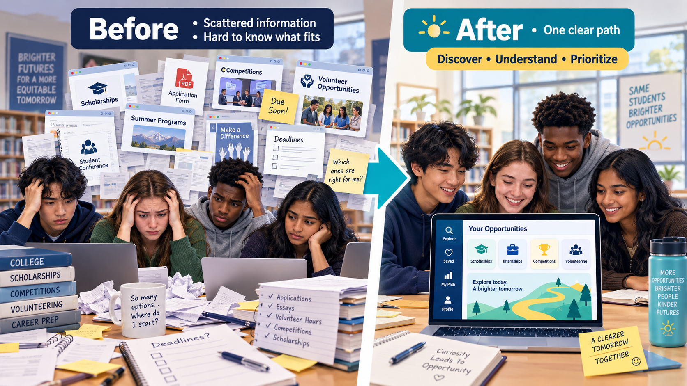
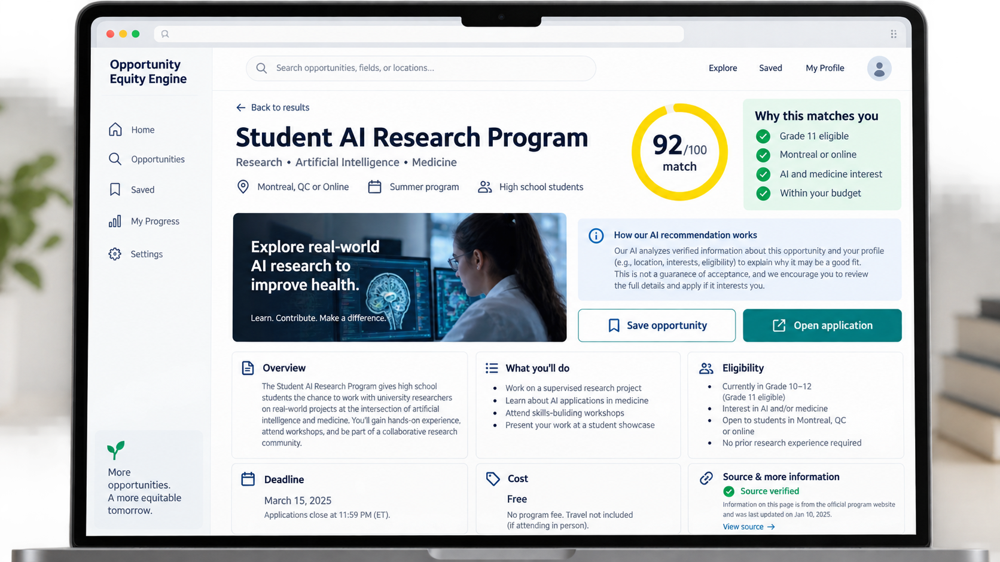
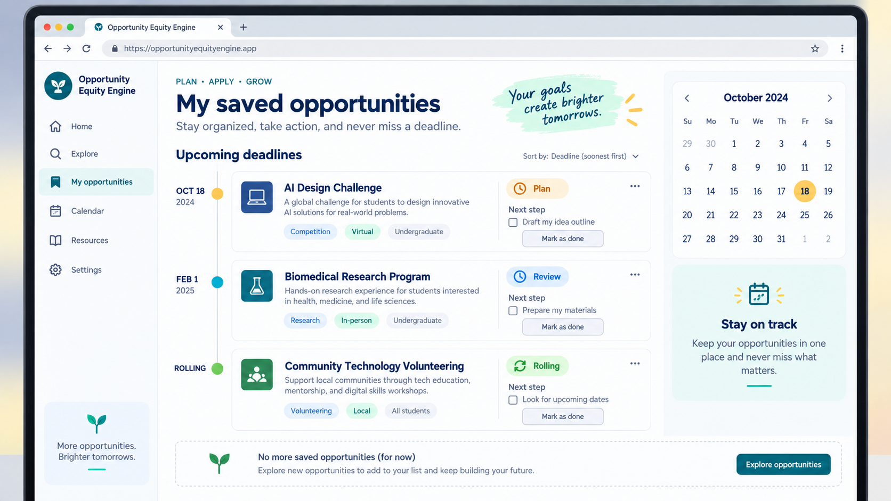
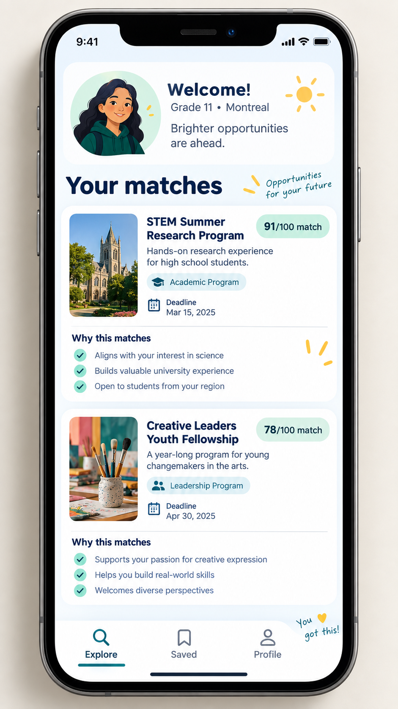

# Opportunity Equity Engine — Demo Deliverables

## Purpose of this document

This document gives the student team a concrete picture of what the finished product should feel like. The images are high-fidelity concept mockups, not screenshots of a completed production application. They show the target user experience, the problems the product should solve, and the screens the team can build step by step.

The pictures use sample names, dates, organizations, and source content. Before a public pilot, replace all sample information with verified opportunity data.

## The product in one sentence

> A student tells the Opportunity Equity Engine who they are and what interests them; the app helps them discover, understand, and prioritize opportunities that may fit.

## Final product journey

```text
Problem: information is scattered
          ↓
Student creates a simple profile
          ↓
App searches verified opportunities
          ↓
Rules check basic eligibility
          ↓
Ranking highlights relevant choices
          ↓
Explanation shows why each result fits
          ↓
Student saves an opportunity and takes the next step
          ↓
More students can access possibilities with less confusion
```

## Deliverable 1 — The problem and the promise



### What this picture communicates

On the left, students face scattered webpages, PDFs, flyers, deadlines, and application forms. They may not know:

- Which opportunities are real and current.
- Which ones fit their grade.
- Which ones are local or online.
- Which ones fit their interests or budget.
- Where to begin.

On the right, the platform turns that confusion into one organized path.

### Product problem resolved

The product does not create more information. It organizes existing information into a clearer starting point.

### Student implementation target

- Create a simple home page that explains the problem.
- Show three example opportunity categories.
- Include one clear call to action: “Find opportunities that fit you.”
- Explain that recommendations are guidance, not a guarantee of acceptance.

### Done when

- A new visitor understands the problem in less than 30 seconds.
- The visitor knows what information the app needs.
- The visitor can start the profile flow without reading a long manual.

## Deliverable 2 — Student dashboard


### What the student sees

The dashboard gives the student a friendly home base:

- A short greeting.
- Their profile summary.
- A search box.
- Recommended opportunities.
- Match scores.
- Deadlines and costs.
- A “Why this matches” explanation.
- Navigation to Explore, Saved, Resources, and Profile.

### User experience goal

The student should feel that the app understands their starting point without feeling judged. The screen should answer:

1. What can I explore?
2. Why are these results shown to me?
3. What can I do next?

### Student implementation target

- Build a dashboard layout with responsive cards.
- Display a profile such as “Grade 11 · Montreal · AI + Medicine.”
- Display three ranked opportunities.
- Make the score visible but explain that it is a guide.
- Add working links to the detail page.

### Done when

- A student can understand the top recommendation without assistance.
- Cards remain readable on a small screen.
- Every displayed opportunity has a deadline status and source link.

## Deliverable 3 — Student onboarding


### What the student sees

The onboarding screen asks only for information needed for matching:

- Interests.
- City or region.
- Grade.
- Maximum budget.
- Preferred language, if needed.

It also explains privacy in friendly language.

### User experience goal

The student should be able to complete the form quickly without feeling that they are filling out a complicated official application.

### Student implementation target

- Add selectable interest chips.
- Add a location selector.
- Add grade selection.
- Add a budget selector or number field.
- Validate missing or invalid values.
- Keep the first version in browser memory rather than storing a permanent profile.

### Done when

- A student can complete onboarding in under two minutes.
- Blank, invalid, and unusual input produces a helpful message.
- The app explains what it does not collect.

## Deliverable 4 — Explore and search


### What the student sees

The Explore page allows the student to search broadly and then narrow the list:

- Search text such as “AI and medicine.”
- Grade filter.
- Location filter.
- Budget filter.
- Category filters.
- Verified status.
- Match scores.
- Deadline and cost.
- Optional comparison selection.

### User experience goal

Recommendations answer “What might fit me?” Explore answers “What else is available?”

### Student implementation target

Implement filters in this order:

1. Category.
2. Location.
3. Maximum cost.
4. Grade.
5. Deadline status.
6. Keyword search.

Use normal code or SQL for these filters. Do not ask an LLM to filter records that can be filtered predictably.

### Done when

- Filters can be combined.
- “Clear filters” works.
- The number of results is visible.
- An empty result has a helpful message and a way to broaden the search.
- Search results show how recently information was verified.

## Deliverable 5 — Opportunity detail page



### What the student sees

The detail page is where trust is built. It should show:

- Opportunity title and organization.
- Category and location.
- Match score.
- Why the opportunity matches the student.
- Overview of the activity.
- What the student may do.
- Eligibility information.
- Deadline.
- Cost.
- Source evidence and verification date.
- Save and application buttons.

### User experience goal

The student should be able to make an informed decision without guessing where the result came from.

### Student implementation target

- Create a detail route such as `/opportunities/[id]`.
- Load one opportunity by ID.
- Display rule results such as grade, location, and budget.
- Link to the official source and application page.
- Add a clear warning if information is old, incomplete, or not confirmed.

### Important rule

The app may say:

> “This appears to be a strong match based on the information provided.”

It must not say:

> “You will be accepted.”

### Done when

- The source and application links work.
- The match explanation can be traced to stored fields.
- Missing facts are shown as missing instead of invented.
- A student can save the opportunity or open the official application.

## Deliverable 6 — Saved opportunities and deadlines



### What the student sees

The Saved page turns discovery into action:

- Saved opportunities sorted by deadline.
- Status such as Plan, Review, or Rolling.
- A next step for each opportunity.
- A simple calendar view.
- A “Mark as done” action.

### User experience goal

The platform should help the student move from “That looks interesting” to “I know what I should do next.”

### Student implementation target

- Add a save button to opportunity cards.
- Store saved opportunity IDs.
- Sort saved records by deadline.
- Show “Rolling” when there is no fixed deadline.
- Add one simple next-step field.
- Add a status selector.

Do not build a complete project-management system for the first release.

### Done when

- A saved item remains available after refreshing the page or signing in.
- The next deadline is easy to identify.
- An expired opportunity is clearly labeled.
- The student can remove a saved item.

## Deliverable 7 — Mobile experience



### What the student sees

The mobile experience focuses on the most important information:

- Profile summary.
- Recommended opportunities.
- Match score.
- Deadline.
- Why the result matches.
- Explore, Saved, and Profile navigation.

### User experience goal

Students should be able to discover an opportunity on a phone without zooming, horizontal scrolling, or reading a dense desktop table.

### Student implementation target

- Use responsive layouts rather than a separate mobile application.
- Test on a narrow browser window.
- Make buttons large enough to tap.
- Keep the first screen focused on one main action.
- Avoid hiding important eligibility information in hover effects.

### Done when

- The profile form works on a phone.
- Recommendation cards stack vertically.
- Links and buttons are easy to tap.
- Text remains readable without zooming.

## Deliverable 8 — Admin review and data quality


### What the administrator sees

The admin review screen protects students from bad information. It shows:

- Records waiting for review.
- Grade range.
- Location.
- Deadline.
- Source type.
- Last checked date.
- Extracted fields.
- Source evidence.
- Approve, edit, and request-verification actions.

### User experience goal

The system should not publish AI-extracted information without a way for a person to check it.

### Student implementation target

- Start with a private review page or controlled review table.
- Add a `needs_review` or `approved` status.
- Store source URL and evidence text.
- Let an authorized reviewer correct fields.
- Keep a verification date.
- Allow records to be unpublished without deleting history.

### Done when

- A reviewer can find uncertain records.
- A reviewer can see the evidence used for extraction.
- A bad or expired opportunity can be hidden from students.
- Public users cannot access admin write actions.

## Deliverable 9 — The ultimate outcome


### What this picture communicates

The ultimate goal is a clear journey:

```text
Discover → Understand → Act → More equitable opportunities
```

The student begins with uncertainty and ends with an informed next step. The product does not guarantee success. It improves access by making possibilities easier to find, compare, understand, and act on.

### Intended impact

- Students discover opportunities beyond the most famous or obvious ones.
- Students understand requirements before spending time applying.
- Students see realistic options based on their own circumstances.
- Students can prioritize deadlines instead of feeling overwhelmed.
- Counselors and reviewers can improve the quality of opportunity information.
- The team can measure whether access and decision confidence improve.

### Done when

- A pilot student can name a new opportunity they would not have found easily.
- The student can explain why it may fit.
- The student knows the next action.
- The team can show evidence of what was improved and what remains limited.

## End-user demo script

Use this script to demonstrate the product in five to seven minutes.

### Scene 1 — The problem

Show the before-and-after image. Explain that information is spread across websites, PDFs, and announcements. The student does not know what fits or where to start.

### Scene 2 — Create a profile

Enter:

```text
Grade: 11
Location: Montreal
Interests: AI, medicine
Budget: $300
```

Explain that the app collects only the information needed for matching.

### Scene 3 — View recommendations

Show the dashboard. Point out the match score, deadline, cost, and “Why this matches” section.

Explain that hard eligibility checks are handled by code and that AI helps interpret language and explain verified facts.

### Scene 4 — Explore alternatives

Open Explore. Search for “AI and medicine.” Apply the Montreal, Grade 11, and under-$300 filters.

Show how the result list changes.

### Scene 5 — Inspect one opportunity

Open the detail page. Show the eligibility information, source evidence, verification date, and official application link.

Say clearly that the score is guidance, not a guarantee of acceptance.

### Scene 6 — Save and plan

Save the opportunity. Open the Saved page. Show the deadline and next step.

### Scene 7 — Show quality control

Open the admin review mockup. Explain that extracted information is checked before it becomes a student-facing recommendation.

### Scene 8 — Explain the outcome

End with:

> The goal is not to make students apply to everything. The goal is to help each student find a few relevant possibilities, understand them, and take a confident next step.

## Implementation mapping

| Visual deliverable | Minimum implementation behind it |
|---|---|
| Problem page | Static homepage and clear value proposition |
| Onboarding | Form state and validation |
| Dashboard | Profile summary, database query, ranked cards |
| Explore | Structured filters and keyword search |
| Detail page | Opportunity-by-ID route, evidence, source links |
| Saved page | Saved IDs, deadline sorting, next-step status |
| Mobile screen | Responsive CSS and mobile testing |
| Admin review | Review status, source evidence, protected edit workflow |
| Impact story | Pilot feedback, usage measures, and presentation narrative |

## Suggested final project package

The final student deliverable should include:

1. A deployed interactive demo.
2. A GitHub repository with reviewed code.
3. A verified sample opportunity dataset.
4. A short README explaining how to run the project.
5. An architecture document.
6. A project timeline and management plan.
7. A beginner learning guide.
8. A test plan and evaluation results.
9. A privacy and data-source note.
10. A five-to-seven-minute demo presentation.
11. Screenshots or mockups showing the intended user experience.
12. A list of known limitations and next steps.

## What the students should not claim

Do not claim that:

- The app knows every opportunity.
- A match score guarantees acceptance.
- AI verified a source without human or rule-based checks.
- The database is current unless it has a verification date.
- The system is unbiased simply because it uses AI.
- A beautiful interface proves that the recommendations are correct.

The strongest presentation is honest about what the team built, what the team measured, and what still needs improvement.

## Final picture of success

The finished product should feel:

- Simple enough for a first-time student user.
- Creative enough that the team can make it their own.
- Trustworthy enough to show its sources and uncertainty.
- Useful enough to change what a student does next.
- Small enough for a high school team to understand and maintain.

> The ultimate deliverable is not only an app. It is a clearer path from curiosity to opportunity.
