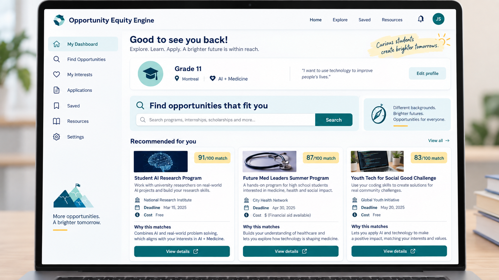

# 机会公平引擎

> 帮助高中生发现、理解并优先选择有意义的机会。

机会公平引擎是一个以学生为中心的平台构想，帮助高中生寻找奖学金、竞赛、科研、志愿服务、暑期项目和大学准备机会。

## 为什么需要这个项目

机会信息分散在网站、PDF、学校通知和申请门户中。学生往往不知道有哪些机会、哪些符合自己的年级和地区、哪些截止日期最重要，也不知道应当先做什么。

项目希望把这条路径变得清晰：

```text
发现 → 理解 → 优先排序 → 行动
```

第一版将收集少量经过核验的机会，支持按年级、地点、类别、费用、语言和截止日期搜索，使用确定性资格规则进行匹配和排序，并允许学生保存机会、追踪下一步，管理员则负责复核和修正数据。

项目目前处于规划和演示设计阶段。推荐的第一版是一个聚焦的 MVP，而不是一开始就覆盖全国的大型平台。

## 第一个 MVP 将做什么

- 收集一小组经过核验的机会。
- 询问简单的学生档案。
- 按年级、地点、类别、费用、语言和截止日期搜索和筛选。
- 应用确定性的资格规则。
- 为相关机会排序。
- 使用经过核验的来源信息解释推荐结果。
- 让学生保存机会并追踪下一步。
- 让管理员审核和修正机会数据。

## 仓库结构

- `docs/00-start-here/`：学生入门、第一次贡献和团队约定
- `docs/01-initiative/`：目的、用户、产品愿景和项目方案
- `docs/02-architecture/`：端到端系统架构
- `docs/03-student-guides/`：入门、先修知识、Vibe Coding 和快速构建指南
- `docs/04-delivery/`：项目管理、角色、成本、风险和时间线
- `docs/05-build/`：分步演示实现
- `docs/06-demo/`：视觉交付物、用户流程和图片素材
- `docs/07-research-and-validation/`：学生研究、同意、来源核验和可用性测试
- `docs/08-student-toolkit/`：GitHub 协作、可访问性、隐私、安全和排障
- `docs/09-showcase-and-reflection/`：展示、作品集证据、致谢和学习反思
- `docs/10-opportunity-sources/`：600 条机会来源目录、核验层级和数据质量规则
- `docs/INDEX.CN.md`：文档索引和推荐阅读路径

## 文档

完整的中文文档从 [中文项目首页](index.CN.md) 开始。英文、中文和法文版本可以通过 GitHub Pages 页面顶部的语言切换器选择。

学生指南包括 [入门项目指南](docs/03-student-guides/BEGINNER_PROJECT_GUIDE.CN.md)、[Vibe Coding 指南](docs/03-student-guides/VIBE_CODING_FOR_STUDENTS.CN.md)、[学习先修知识](docs/03-student-guides/LEARNING_PREREQUISITES.CN.md) 和 [快速构建应用和网站指南](docs/03-student-guides/QUICK_APP_AND_WEBSITE_BUILD_GUIDE.CN.md)。新增的 [600 条机会来源目录](docs/10-opportunity-sources/Opportunity_Equity_Engine_600_Sources.CN.md)包含研究来源、核验级别、数据字段和质量规则。

| 文档 | 用途 |
|---|---|
| [文档索引](docs/INDEX.CN.md) | 主题地图和推荐阅读路径 |
| [从这里开始](docs/00-start-here/START_HERE.CN.md) | 第一个小时的入门、角色、团队约定和完成标准 |
| [项目倡议](docs/01-initiative/initiative.CN.md) | 目的、用户、问题、目标、原则和影响 |
| [架构](docs/02-architecture/architecture.CN.md) | 端到端系统架构和技术设计 |
| [入门项目指南](docs/03-student-guides/BEGINNER_PROJECT_GUIDE.CN.md) | 没有经验的学生从零开始完成演示的指南 |
| [Vibe Coding 指南](docs/03-student-guides/VIBE_CODING_FOR_STUDENTS.CN.md) | 降低技术门槛，同时保持创造力的方法 |
| [学习先修知识](docs/03-student-guides/LEARNING_PREREQUISITES.CN.md) | 需要发展的知识、技术差距和学习路线 |
| [快速构建指南](docs/03-student-guides/QUICK_APP_AND_WEBSITE_BUILD_GUIDE.CN.md) | 响应式网站、PWA、iPhone 原型和学生测试的快速路径 |
| [演示实现指南](docs/05-build/DEMO_IMPLEMENTATION_GUIDE.CN.md) | 包含代码示例的分步实现指南 |
| [项目管理计划](docs/04-delivery/PROJECT_MANAGEMENT_PLAN.CN.md) | 方案、工具、成本、角色、风险和团队流程 |
| [项目时间线](docs/04-delivery/PROJECT_TIMELINE.CN.md) | 预计 16 周的交付计划和里程碑 |
| [演示交付物](docs/06-demo/DEMO_DELIVERABLES.CN.md) | 用户流程、实现目标和视觉素材 |
| [研究与验证](docs/07-research-and-validation/RESEARCH_AND_VALIDATION.CN.md) | 访谈、来源核验、可用性测试和证据 |
| [600 条机会来源目录](docs/10-opportunity-sources/Opportunity_Equity_Engine_600_Sources.CN.md) | 研究来源、核验级别、录入字段和数据质量规则 |
| [学生工具箱](docs/08-student-toolkit/STUDENT_TOOLKIT.CN.md) | 协作、可访问性、隐私、负责任的 AI 和排障 |
| [展示与反思](docs/09-showcase-and-reflection/SHOWCASE_AND_REFLECTION.CN.md) | 展示、作品集证据、致谢和学生反思 |
| [AI 项目方案](docs/01-initiative/Opportunity_Equity_Engine.CN.md) | 详细的产品和 AI 项目方案 |

## 产品预览



查看完整的[演示交付物和产品视觉流程](docs/06-demo/DEMO_DELIVERABLES.CN.md)。

## 推荐技术方向

```text
前端：Next.js + React + TypeScript
后端：FastAPI 或第一版使用简单的 Next.js API 层
数据库：Supabase PostgreSQL
搜索：结构化筛选、关键词搜索，之后再考虑 pgvector
AI：结构化提取和有依据的解释
部署：Vercel + Supabase 或同类托管服务
协作：GitHub + AI 辅助的 Vibe Coding
```

团队不需要在开始前掌握每种语言。Vibe Coding 可以帮助生成样板代码并解释陌生代码。学生仍然负责产品决策、测试、隐私、数据核验和最终结果。

## 交付方式

1. 从一个目标用户和一个小问题开始。
2. 构建一条垂直切片：档案 → 数据 → 匹配 → 结果。
3. 从人工核验的样例数据开始。
4. 在高级 AI 之前先加入确定性的资格规则。
5. 在验证和人工审核下加入 AI 提取与解释。
6. 与真实学生测试，并优先改进影响最大的问题。
7. 部署一个小而可信的试点。

## 安全与信任原则

- 不编造截止日期、要求、费用或项目收益。
- 展示来源 URL 和核验日期。
- 在核验前把 AI 生成的数据视为不可信。
- 使用代码实现确定性的资格规则。
- 只收集匹配所需的学生信息。
- 不要把秘密放进 Git 或浏览器代码。
- 清楚标记不确定性，并说明匹配分数只是指导。

## 在线文档站点

访问[GitHub Pages 站点](https://andyxuan.ca/OpportunityEquityEngine/)查看文档和产品愿景。

## 仓库状态

仓库目前包含项目倡议、架构、学习、交付、实现、研究、机会来源目录、工具箱、时间线、展示和演示设计文档。下一项主要里程碑是实现 [演示实现指南](docs/05-build/DEMO_IMPLEMENTATION_GUIDE.CN.md) 中描述的小型垂直切片。
- 使用 AI 协助提取和解释，但让代码、规则和人工复核负责正确性。
