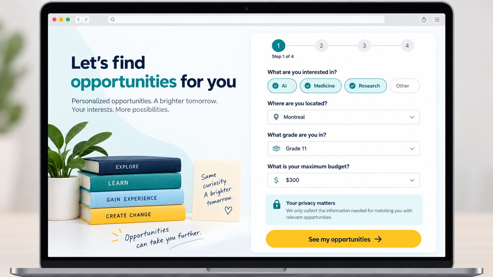
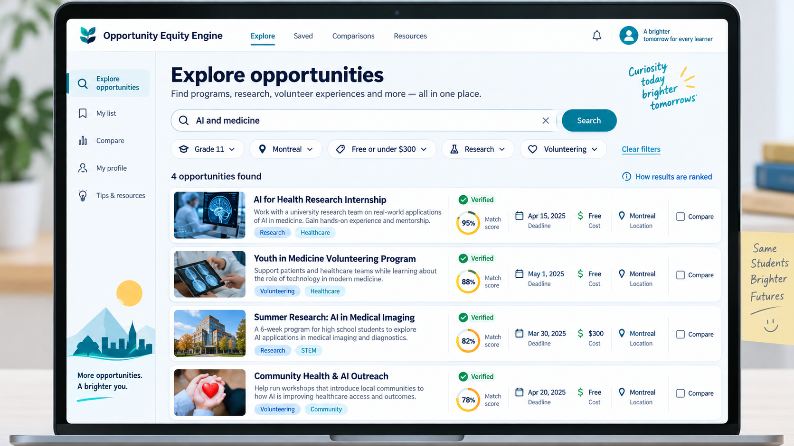
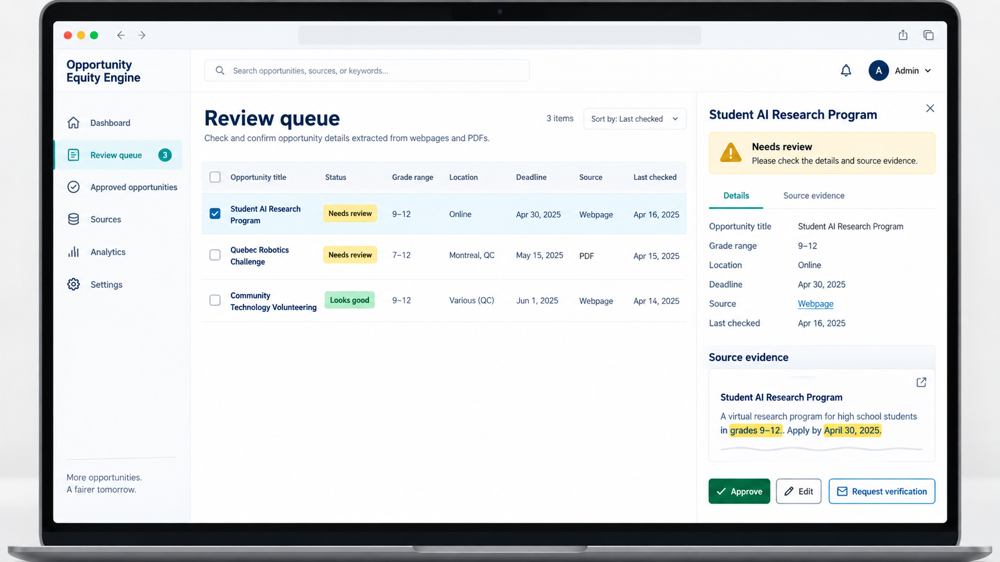
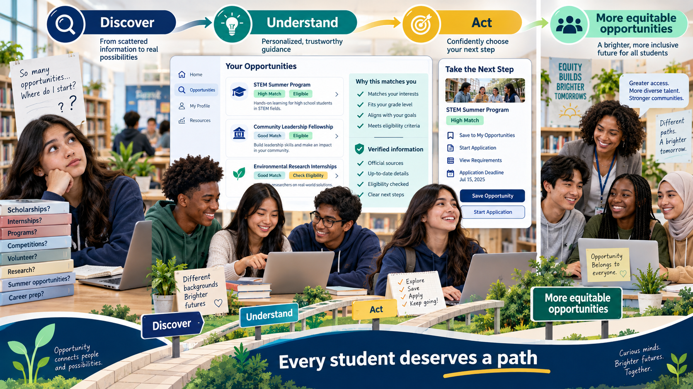

# Opportunity Equity Engine

## More opportunities. A clearer path.

The Opportunity Equity Engine is a student-led initiative helping high school students discover, understand, and prioritize scholarships, competitions, research, volunteering, summer programs, and university-preparation opportunities.

> From scattered information to a confident next step.

| [Explore the initiative](docs/01-initiative/initiative.md) | [View the product journey](docs/06-demo/DEMO_DELIVERABLES.md) | [Start building](docs/03-student-guides/BEGINNER_PROJECT_GUIDE.md) |
|---|---|---|

## At a glance

| | |
|---|---|
| **Audience** | High school students, initially in Montreal and Quebec |
| **Challenge** | Opportunity information is scattered, difficult to compare, and easy to miss |
| **Response** | Verified information, clear eligibility, relevant ranking, and actionable next steps |
| **Approach** | Vibe coding + structured data + deterministic rules + grounded AI |
| **Current stage** | Initiative, design, and demo-planning stage |
| **North-star goal** | Every student deserves a path from curiosity to opportunity |

## The opportunity gap

Students often face disconnected websites, PDFs, school announcements, deadlines, and application portals. The problem is not a lack of ambition; it is a lack of clear, timely, understandable access.

The platform is designed to answer five simple questions:

1. What opportunities exist?
2. Which ones fit my grade and location?
3. Which ones connect to my interests?
4. What can I afford?
5. What should I do next?


## The product experience

### 1. Start with a simple profile

The student enters only the information needed for matching, such as grade, region, interests, language, budget, and availability.



### 2. Receive understandable recommendations

The dashboard presents ranked opportunities with match scores, deadlines, costs, and reasons grounded in the stored information.


### 3. Explore the wider opportunity space

Search and filters let students explore beyond the first recommendations by category, location, cost, language, grade, and deadline.



### 4. Understand before acting

Each detail page shows eligibility information, source evidence, verification status, and the official application link.


### 5. Save a next step

Students can save opportunities and organize deadlines so discovery becomes action.


## Trust by design

AI is used where language understanding is helpful. Traditional code and human review are used where correctness matters.

```text
Permitted source information
          ↓
AI-assisted extraction
          ↓
Validation and human review
          ↓
Structured opportunity record
          ↓
Deterministic eligibility rules
          ↓
Transparent ranking and explanation
          ↓
Student chooses the next step
```

The platform must never invent requirements, deadlines, costs, or acceptance outcomes. Match scores are guidance, not guarantees.



## Built by students, with creativity first

The project is designed for high school students, including beginners. Vibe coding helps students cross programming-language and technical barriers by allowing them to:

- Describe an idea in ordinary language.
- Generate a small piece of working code.
- Ask why it works.
- Test it and learn from errors.
- Improve the experience based on real user feedback.

The AI is the technical building partner. Students remain the product owners, designers, researchers, testers, and decision-makers.

## Documentation map

Use [docs/INDEX.md](docs/INDEX.md) as the central index. The documentation is organized like a professional project repository:

| Topic | Contents |
|---|---|
| [01 — Initiative](docs/01-initiative/initiative.md) | Purpose, audience, problem, goal, product vision, and bilingual plans |
| [02 — Architecture](docs/02-architecture/architecture.md) | System components, data model, matching, search, security, and operations |
| [03 — Student guides](docs/03-student-guides/BEGINNER_PROJECT_GUIDE.md) | Beginner path, vibe coding, prerequisites, and knowledge gaps |
| [04 — Delivery](docs/04-delivery/PROJECT_MANAGEMENT_PLAN.md) | Roles, tools, cost, risks, team process, and 16-week timeline |
| [05 — Build](docs/05-build/DEMO_IMPLEMENTATION_GUIDE.md) | Step-by-step implementation, code examples, testing, and deployment |
| [06 — Demo](docs/06-demo/DEMO_DELIVERABLES.md) | End-user screens, presentation flow, and visual product deliverables |

## Recommended starting paths

### For a student who is new to technology

[Beginner project guide](docs/03-student-guides/BEGINNER_PROJECT_GUIDE.md) → [Vibe coding guide](docs/03-student-guides/VIBE_CODING_FOR_STUDENTS.md) → [Demo implementation](docs/05-build/DEMO_IMPLEMENTATION_GUIDE.md)

### For a team organizing the semester

[Initiative](docs/01-initiative/initiative.md) → [Management plan](docs/04-delivery/PROJECT_MANAGEMENT_PLAN.md) → [Project timeline](docs/04-delivery/PROJECT_TIMELINE.md)

### For a technical reviewer

[Architecture](docs/02-architecture/architecture.md) → [Learning prerequisites](docs/03-student-guides/LEARNING_PREREQUISITES.md) → [Demo deliverables](docs/06-demo/DEMO_DELIVERABLES.md)

## The ultimate goal

The goal is not to make students apply to everything. The goal is to help each student find a few relevant possibilities, understand them, and act with greater confidence.



## Project status

The repository contains the initiative charter, architecture, student guides, delivery plan, implementation guide, timeline, and visual demo deliverables. The next milestone is a small vertical slice:

```text
Profile → Verified sample data → Eligibility → Match score → Explanation
```

## Live site

This documentation is published at [andyxuan.ca/OpportunityEquityEngine](https://andyxuan.ca/OpportunityEquityEngine/).
